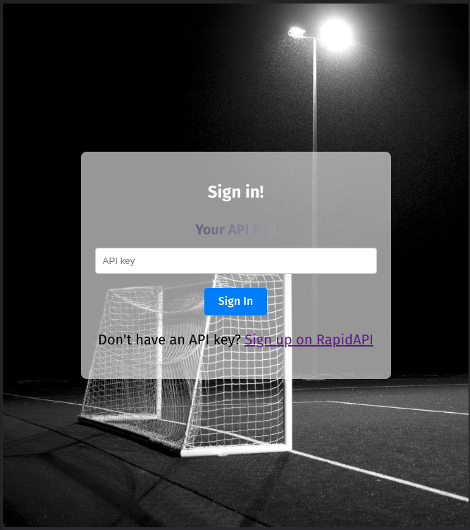
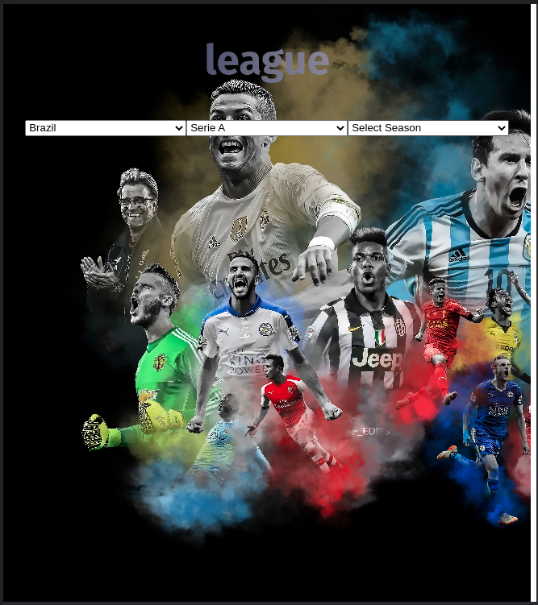
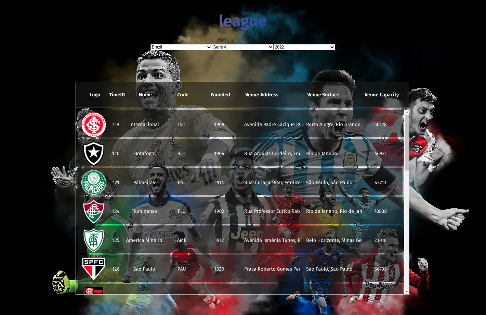
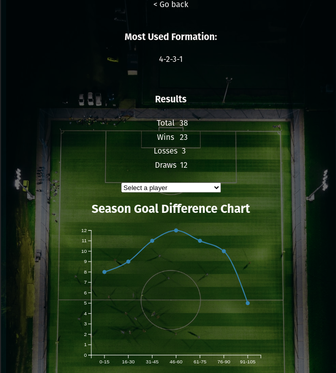
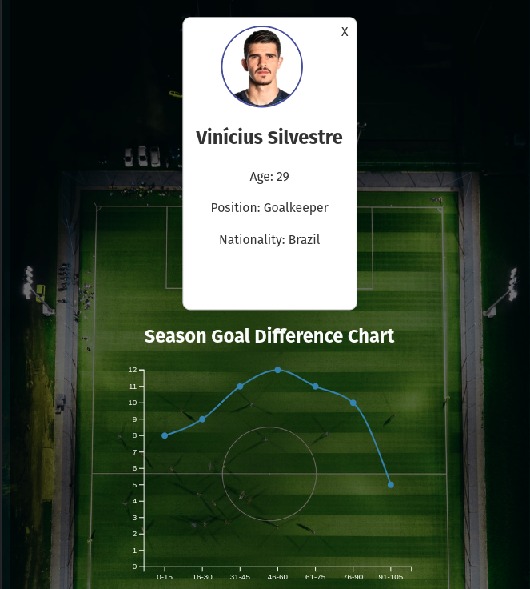

# Projeto: Plataforma de Estatísticas de Futebol

Um projeto que permite visualizar estatísticas de futebol, incluindo informações sobre times, jogadores e gols marcados. A plataforma oferece recursos de login, seleção de liga e temporada, exibição de tabelas de times, estatísticas de times, acesso a jogadores e gráficos de gols.

## Funcionalidades

***Login:*** Para acessar a plataforma, é necessário inserir a chave da API. Caso não possua uma chave, é possível criar uma clicando em "Sign up API".

***Seleção de Liga e Temporada:*** Após fazer o login, o usuário deve escolher o país desejado para selecionar a liga e temporada correspondentes.

***Tabela de Times:*** Uma tabela será exibida com os times da temporada selecionada.

***Estatísticas do Time:*** Ao clicar em um time na tabela, serão exibidas informações estatísticas, como a formação mais utilizada na temporada e o resultado dos jogos (total de jogos, vitórias, derrotas e empates).

***Acesso a Jogadores:*** É possível selecionar um jogador específico e visualizar seu card com informações detalhadas.

***Gráfico de Gols:*** Abaixo do card do jogador, um gráfico contabiliza os gols marcados no intervalo de cada 15 minutos.

## Como Executar o Projeto

Clone o repositório para sua máquina local.
Instale as dependências do projeto utilizando o comando npm install.
Execute o projeto localmente com o comando npm start.
Acesse a plataforma através do navegador usando o endereço:
```http://localhost:5173.```

### Exemplo de Uso

Faça o login na plataforma utilizando sua chave de API.


Selecione o país desejado para escolher a liga e 
temporada correspondentes.


Explore a tabela de times para visualizar os dados estatísticos de cada time.


Clique em um time para obter mais informações sobre sua formação e resultados dos jogos.


Acesse a seção de jogadores e escolha um jogador para ver seu card com informações detalhadas.


Observe o gráfico de gols, que apresenta a contagem de gols no intervalo de cada 15 minutos.
